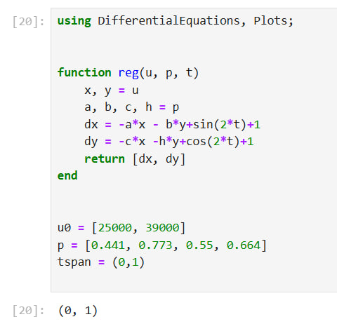
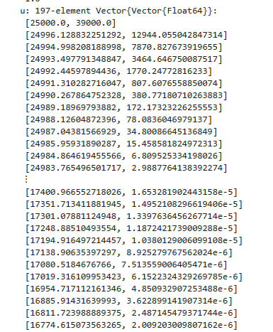

---
## Front matter
lang: ru-RU
title: "Лабораторная работа №3"
subtitle: "Модель боевых действий "
author:
  - Извекова Мария Петровна
institute:
  - Российский университет дружбы народов, Москва, Россия


## i18n babel
babel-lang: russian
babel-otherlangs: english

## Formatting pdf
toc: false
toc-title: Содержание
slide_level: 2
aspectratio: 169
section-titles: true
theme: metropolis
header-includes:
 - \metroset{progressbar=frametitle,sectionpage=progressbar,numbering=fraction}
---

# Информация

## Докладчик

:::::::::::::: {.columns align=center}
::: {.column width="60%"}

  * Извекова Мария Петровна
  * студентка 3 курса
  * факультет Физико-математических и естественных наук
  * Российский университет дружбы народов

:::
::: {.column width="30%"}


:::
::::::::::::::

# Цель работы

Построить математическую модель для выбора правильной стратегии при решении примера задаче о погоне.

# Задание

Между страной Х и страной У идет война. Численность состава войск
исчисляется от начала войны, и являются временными функциями
xt()и yt(). В начальный момент времени страна Х имеет армию численностью 25 000 человек, а
в распоряжении страны У армия численностью в 39 000 человек. Для упрощения
модели считаем, что коэффициенты a, b, c, h
постоянны. Также считаем Pt() и Qt()
непрерывные функции.

#
1. Модель боевых действий между регулярными войсками
$\frac{d x}{d t} = -0.411*x(t) - 0.733*y(t) + sin(2*t)+1$ и $\frac{d y}{d t} = -0.55*x(t) -0.664*y(t) + cos(2*t)+1$

# 

2. Модель ведение боевых действий с участием регулярных войск и
партизанских отрядов
$\frac{d x}{d t} = -0.399*x(t)y(t) - 0.688*y(t) + sin(2*t)+2$ и $\frac{d y}{d t} = -0.299*x(t) -0.811*y(t) + cos(3*t)+1$

# Задание

Постройте графики изменения численности войск армии Х и армии У для
следующих случаев

Рассмотреть три случая ведения боевых действий:
1. Боевые действия между регулярными войсками
2. Боевые действия с участием регулярных войск и партизанских
отрядов
3. Боевые действия между партизанскими отрядами 


# Выполнение лабораторной работы

Формула для выбора варианта: `(1132226460%70)+1` = 51 вариант.

# Модель боевых действий между регулярными войсками

::: columns
::: column
{#fig:001 width=60%}
:::

::: column
{#fig:001 width=60%}
:::
:::

#

В результате получаем следующий график

{#fig:001 width=60%}

#
Теперь давайте построим эту же модель посредством OpenModelica.

``` modelica
model lab3
  parameter Real a = 0.441;
  parameter Real b = 0.773;
  parameter Real c = 0.55;
  parameter Real h = 0.664;
  parameter Real x0 = 25000;
  parameter Real y0 = 39000;
  Real x(start=x0);
  Real y(start=y0);
equation
  der(x) = -a*x - b*y+sin(2*time)+1;
  der(y) = -c*x -h*y+cos(2*time)+1;
end lab3;
```
#

{#fig:001 width=60%}


# Модель ведение боевых действий с участием регулярных войск и партизанских отрядов

Построим модель на Julia:

::: columns
::: column
{#fig:001 width=60%}
:::

::: column
{#fig:001 width=60%}
:::
:::


#
::: columns
::: column
{#fig:001 width=60%}
:::

::: column
{#fig:001 width=60%}
:::
:::

#
Уменьшаем масштаб, чтобы увидеть, где начинается уменьшение армии Y

{#fig:001 width=60%}

#

Теперь давайте построим эту же модель посредством OpenModelica.

``` 
model lab3_part
  parameter Real a = 0.399;
  parameter Real b = 0.688;
  parameter Real c = 0.299;
  parameter Real h = 0.811;
  parameter Real x0 = 25000;
  parameter Real y0 = 39000;
  Real x(start=x0);
  Real y(start=y0);
equation
  der(x) = -a*x - b*y+sin(2*time)+2;
  der(y) = -c*x*y -h*y+cos(3*time)+1;
end lab3_part;

```

#
{#fig:001 width=60%}

#
Уменьшаем масштаб, чтобы увидеть, где начинается уменьшение армии Y

{#fig:001 width=60%}


## Выводы

В процессе выполнения данной лабораторной работы я построила модель боевых действий на языке прогаммирования Julia и посредством ПО OpenModelica, а также провела сравнительный анализ.