---
## Front matter
title: "Лабораторная работа №3"
subtitle: "Модель боевых действий "
author: "Извекова Мария Петровна"
date:   "2025-03-22"
documentclass: article  # Или другой класс документа, например, report, book
lang: ru-RU  # Важно для поддержки русского языка
output:
  pdf_document:
    latex_engine: xelatex
    toc: true
    number_sections: true
---


# Цель работы

Построить математическую модель для выбора правильной стратегии при решении примера задаче о погоне.

# Задание

Между страной Х и страной У идет война. Численность состава войск
исчисляется от начала войны, и являются временными функциями
xt()и yt(). В начальный момент времени страна Х имеет армию численностью 25 000 человек, а
в распоряжении страны У армия численностью в 39 000 человек. Для упрощения
модели считаем, что коэффициенты a, b, c, h
постоянны. Также считаем Pt() и Qt()
непрерывные функции.

1. Модель боевых действий между регулярными войсками
$\frac{d x}{d t} = -0.411*x(t) - 0.733*y(t) + sin(2*t)+1$ и $\frac{d y}{d t} = -0.55*x(t) -0.664*y(t) + cos(2*t)+1$

2. Модель ведение боевых действий с участием регулярных войск и
партизанских отрядов
$\frac{d x}{d t} = -0.399*x(t)y(t) - 0.688*y(t) + sin(2*t)+2$ и $\frac{d y}{d t} = -0.299*x(t) -0.811*y(t) + cos(3*t)+1$

Постройте графики изменения численности войск армии Х и армии У для
следующих случаев

Рассмотреть три случая ведения боевых действий:
1. Боевые действия между регулярными войсками
2. Боевые действия с участием регулярных войск и партизанских
отрядов
3. Боевые действия между партизанскими отрядами 

# Теоретическое введение

Рассмотрим некоторые простейшие модели боевых действий – модели
Ланчестера. В противоборстве могут принимать участие как регулярные войска,
так и партизанские отряды. В общем случае главной характеристикой соперников
являются численности сторон. Если в какой-то момент времени одна из
численностей обращается в нуль, то данная сторона считается проигравшей (при
условии, что численность другой стороны в данный момент положительна).

В первом случае численность регулярных войск определяется тремя
факторами:
 скорость уменьшения численности войск из-за причин, не связанных с
боевыми действиями (болезни, травмы, дезертирство);
 скорость потерь, обусловленных боевыми действиями
противоборствующих сторон (что связанно с качеством стратегии,
уровнем вооружения, профессионализмом солдат и т.п.);
 скорость поступления подкрепления (задаётся некоторой функцией от
времени).

Во втором случае в борьбу добавляются партизанские отряды. Нерегулярные
войска в отличии от постоянной армии менее уязвимы, так как действуют скрытно,
в этом случае сопернику приходится действовать неизбирательно, по площадям,
занимаемым партизанами. Поэтому считается, что тем потерь партизан,
проводящих свои операции в разных местах на некоторой известной территории,
пропорционален не только численности армейских соединений, но и численности
самих партизан.

# Выполнение лабораторной работы

Формула для выбора варианта: `(1132226460%70)+1` = 51 вариант.

## Модель боевых действий между регулярными войсками

$\frac{d x}{d t} = -0.411*x(t) - 0.733*y(t) + sin(2*t)+1$ и $\frac{d y}{d t} = -0.55*x(t) -0.664*y(t) + cos(2*t)+1$

Потери, не связанные с боевыми действиями, описывают члены  -0.411x(t) и -0.664y(t) (коэффиценты при x и y - это величины, характеризующие степень влияния различных факторов на потери), члены - 0.733y(t) и-0.55x(t) отражают потери на поле боя (коэффиценты при x и y
указывают на эффективность боевых действий со стороны у и х соответственно). Функции P(t) = sin(2t)+1, Q(t) = cos(2t)+ 1 учитывают возможность подхода подкрепления к войскам Х и У в течение одного дня.

Для начала построим эту модель на Julia:

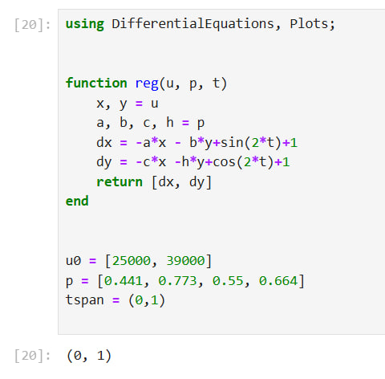{#fig:001 width=70%}

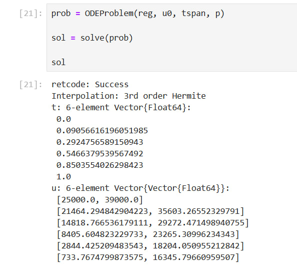{#fig:001 width=70%}

В результате получаем следующий график

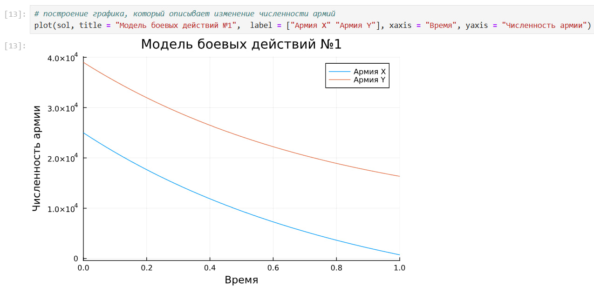{#fig:001 width=70%}

Из графика видно, чтол выиграла армия страны X, поскольку численность армии страны Y стала 0, а потом и вообще ушла в отрицательную часть графика. Потери страны X можно считать незначительными.

Теперь давайте построим эту же модель посредством OpenModelica.

Здесь модель строить еще проще. Мы просто задаем параметры, начальные условия, определяем систему уравнений и просим программу выполнить симуляцию этой модели.

``` modelica
model lab3
  parameter Real a = 0.441;
  parameter Real b = 0.773;
  parameter Real c = 0.55;
  parameter Real h = 0.664;
  parameter Real x0 = 25000;
  parameter Real y0 = 39000;
  Real x(start=x0);
  Real y(start=y0);
equation
  der(x) = -a*x - b*y+sin(2*time)+1;
  der(y) = -c*x -h*y+cos(2*time)+1;
end lab3;
```

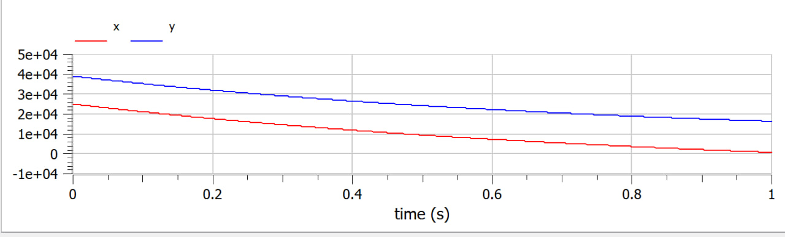{#fig:001 width=70%}

Здесь все также видно, что выиграла армия X.

Также заметим, что график, построенный на Julia, и график из OpenModelica ничем не отлоичаются. По крайней мере невооруженным глазом отличий не видно.

## Модель ведение боевых действий с участием регулярных войск и партизанских отрядов

Во втором случае в борьбу добавляются партизанские отряды. Нерегулярные войска в отличии от постоянной армии менее уязвимы, так как действуют скрытно, в этом случае сопернику приходится действовать неизбирательно, по площадям, занимаемым партизанами. Поэтому считается, что тем потерь партизан, проводящих свои операции в разных местах на некоторой известной территории, пропорционален не только численности армейских соединений, но и численности самих партизан. В результате модель принимает вид:

$\frac{d x}{d t} = -0.399*x(t)y(t) - 0.688*y(t) + sin(2*t)+2$ и $\frac{d y}{d t} = -0.299*x(t) -0.811*y(t) + cos(3*t)+1$

В этой системе все величины имею тот же смысл, что и в первой модели.

Построим модель на Julia:

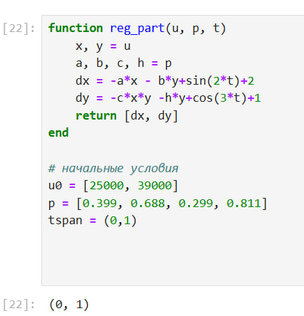{#fig:001 width=70%}

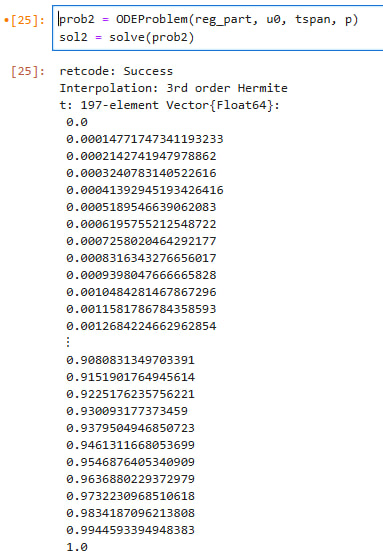{#fig:001 width=70%}

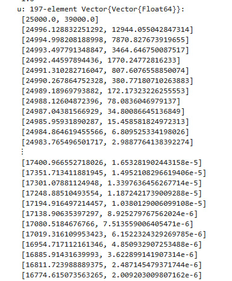{#fig:001 width=70%}

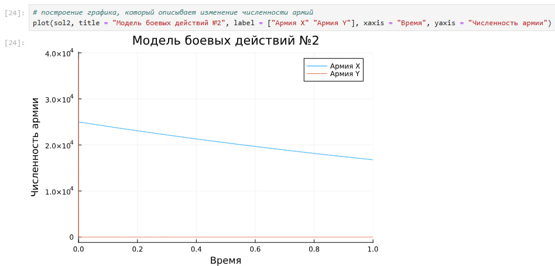{#fig:001 width=70%}

Уменьшаем масштаб, чтобы увидеть, где начинается уменьшение армии Y

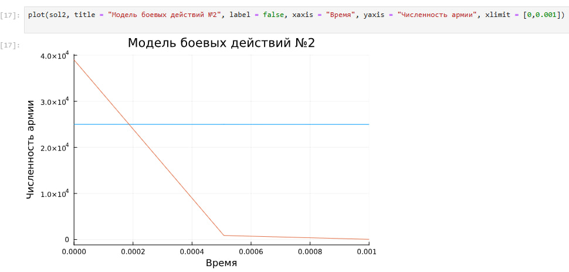{#fig:001 width=70%}

Здесь опять же выигрывает армия X, причем численность армии Y уменьшается до нуля практически моментально. Заметим также, что даже после того как армия X победила (то есть численность армии Y стала равна 0), ее численность продолжает уменьшаться на заданном интервале (поскольку у нас есть коэффиценты, характеризующие степень влияния различных факторов на потери). На данном графике сложно отследить, как происходило уменьшение численности армии Y, поэтому давайте возьмем временной интервал поменьше, чтобы было более наглядно, как умирает армия Y

Теперь давайте построим эту же модель посредством OpenModelica.

``` 
model lab3_part
  parameter Real a = 0.399;
  parameter Real b = 0.688;
  parameter Real c = 0.299;
  parameter Real h = 0.811;
  parameter Real x0 = 25000;
  parameter Real y0 = 39000;
  Real x(start=x0);
  Real y(start=y0);
equation
  der(x) = -a*x - b*y+sin(2*time)+2;
  der(y) = -c*x*y -h*y+cos(3*time)+1;
end lab3_part;

```

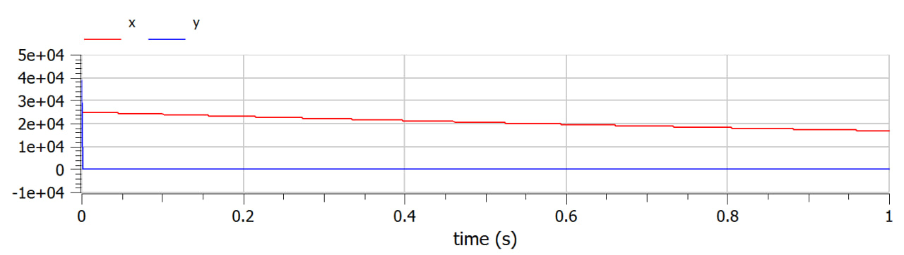{#fig:001 width=70%}

Уменьшаем масштаб, чтобы увидеть, где начинается уменьшение армии Y

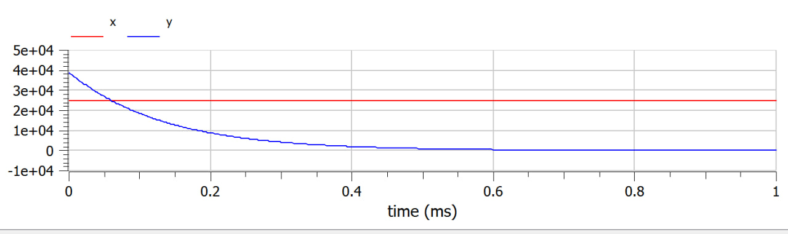{#fig:001 width=70%}

На графике теперь видно, как происходит вымирание людей в армии Y. За этот интервал армия X даже не успела сократиться в своей численности.

Сравнивая графики, полученные в Julia и OpenModelica, разницы особой незаметно. Если сильно вглядываться, можно заметить, что в OpenModelica график чуть более плавный и точный.

## Выводы

В процессе выполнения данной лабораторной работы я построила модель боевых действий на языке прогаммирования Julia и посредством ПО OpenModelica, а также провела сравнительный анализ.